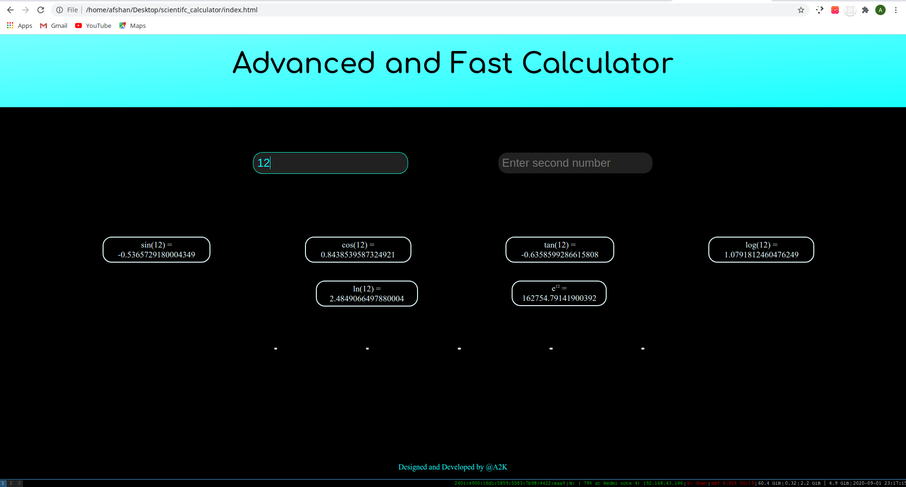
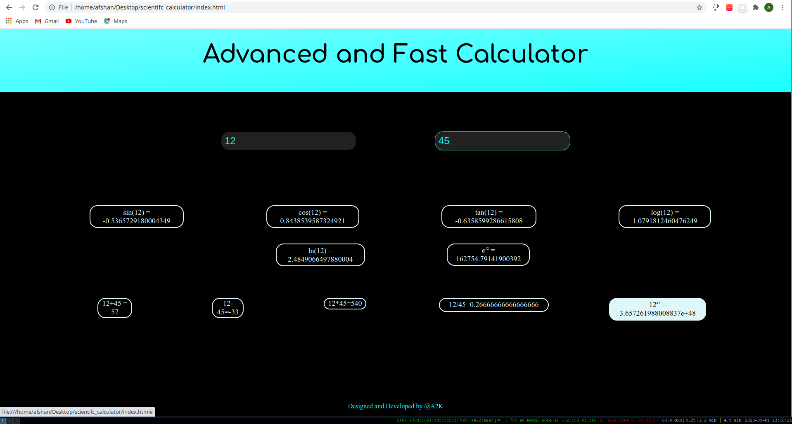

# Fast calculator 
<b> A simple , fast and responsive and  </b>

### Enter first number
 Enter number in first number input field then either press <code>Enter</code> or click elsewhere so that focus on first number input field goes out .

### Enter second number
 Enter number in second input field then press <code>Eneter</code>

## Usage :
* For operations such as sin,cos which need one number just enter number in first field .
* For operations such as addition , subtraction enter number in second field also .
* When you click on any of the result button then the result will get enetered in first number field .

## screenshots

#### Further improvements which I will try to do soon ..
Adding history div

